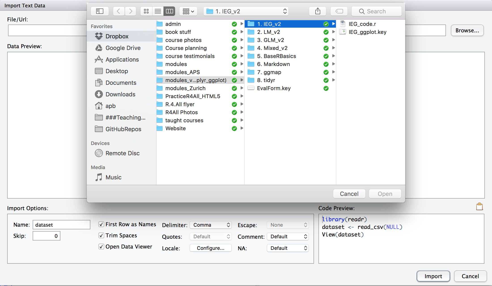
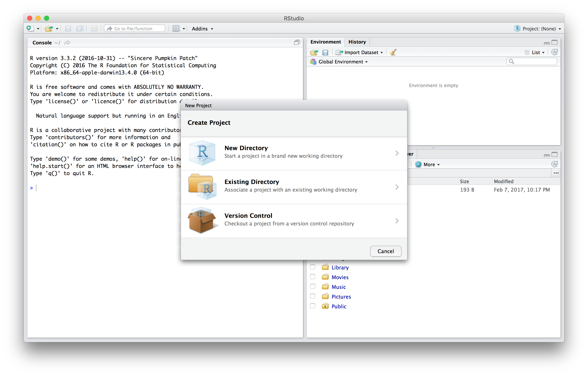
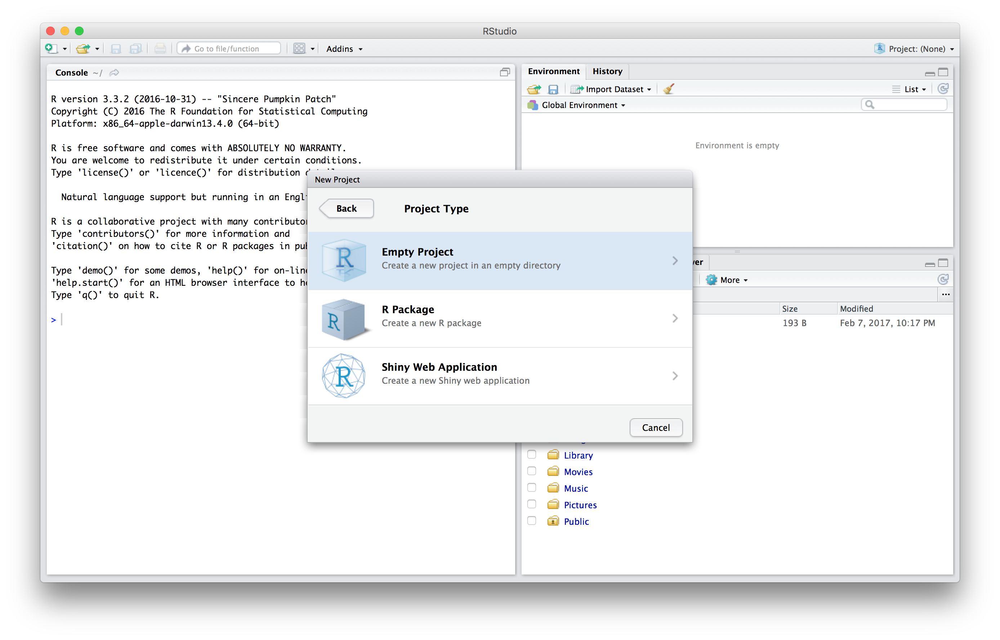
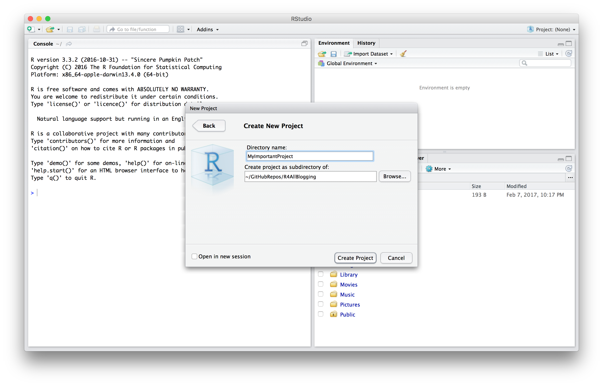
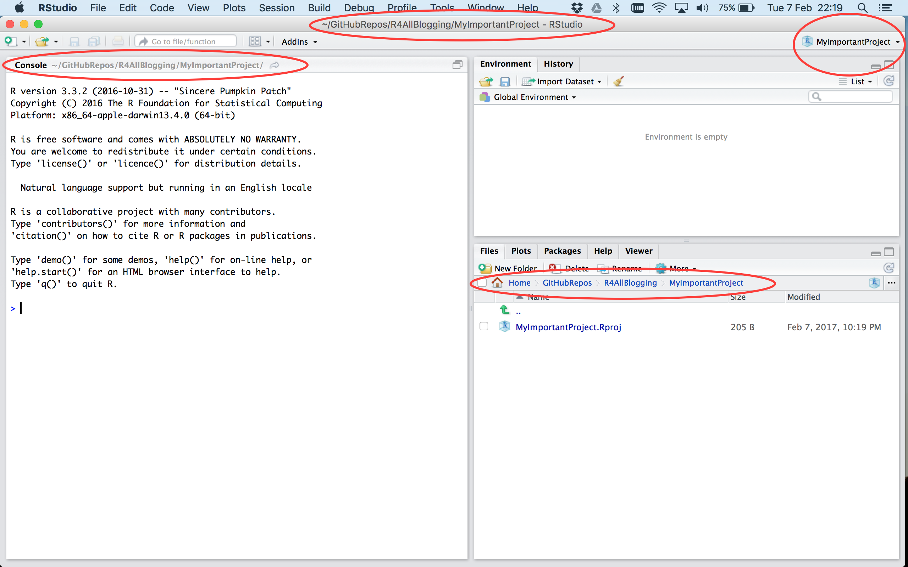

```{r setup, include=FALSE}
knitr::opts_chunk$set(echo = TRUE)
```

## Projects versus Scripts

In a recent twitter interaction with @HadleyWikham and @PadPadPad, there was a discussion about using a script that starts with `rm(list=ls())` and `setwd()` versus _RStudio Projects_.  @HadleyWikham pointed out that using `rm(list=ls())` and `setwd()` was sub-optimal, not least because `rm(list =ls()` does not truly reset R (get rid of datasets, packages and objects associated with one project before starting another) when you start analysing a new dataset, and there are potentially more efficient ways to define the folder (working directory) in which your scripts, data files and other things live on your computer. 

While we agree, totally, this post is about multiple ways to achieve a holy grail of data analysis: whether you can share your analysis pipeline with yourself six months after not looking at it (e.g. post-submission of a manuscript) or colleagues and collaborators, without them (you) getting confused, and without using the wrong data.

This post lays out details about three ways to achieve similar end objectives - an organised collection of files needed to ensure shareable, repeatable and robust analysis of your data. A major component of this post is thus an attempt to help new users of R understand a bit about how to, and the value of, organising scripts, files that hold data and other notes about your research projects in clear and shareable ways.  It is targeted at new users of R, mostly.

## Some definitions to start
Central to everything we talk about below are details about a few semi-technical terms about your computer.  Some are specific to operating systems, but most are not.  Lets get started with some big 'ideas'.

1. File System
2. Directory Structure
3. Directory Hierarchy

These three things exist on PCs, Macs and Unix/Linux machines. They are rather technical terms for rather simple things.  All of them are what you see when you use:

1. Windows Explorer
2. The Macintosh Finder
3. Any of the tools available on Unix and Linux distributions that lets you look at files

Underneath these technical terms are simple ideas.  You make files on your computer using applications/programmes. These often have sets of 1-3 letters on the end of them, indicating in which application/programme they were made.  Microsoft Word produces files with .doc or .docx. R typically produces files with .R or .r at the end.  These are _file extenstions_ and give you information about what application/programme you used to make them, and helps your computer determine which application/programme to use when you ask to open them (via double clicking on the icon, for example).

When you make files on your computer, you store them on the computer's hard drive.  How people do this is highly variable.  Some people make folders with very specific names, and then make folders inside these, and then put files inside these folders.  

If you do this, you make and use a _directory hierarchy_ which has a _path_ associated with it.  The _path_ is the __address__ that the computer, and you, can use to identify where things are. Directory is just another word for a _folder_ on your computer!

For example, you may work like this.

Windows: `My Documents/Manuscripts/TemperatureExperiment2017/AnalysisFolder`

or

Mac: `Documents/Manuscripts/TemperatureExperiment2017/AnalysisFolder`

Each of these is a _path_ and defines a route to the __AnalysisFolder_ on your computer.  Each of these words is also formally a _directory_.

Because there are folders 'nested' inside folders, and ultimately files inside these folders, we call this a `directory hierarchy'. It has a __nested structure__.

Note that some people don't do this...  or don't seem to.  If you (or they) store stuff on your (their) desktop (yes, many do), don't forget that the Desktop _is_ formally a folder too.... really.  It is.  It also has a path.

## Three Ways to Achieve the Same End
The remainder of this post is about three different ways to achieve the same end.  All of them work.  It allows a bit of flexibility in how you do things.  It also allows people still not using RStudio (gasp) to achieve almost the same ends in two ways!  This can be good if you, like us, work with some hard to change dinosaurs!

The three ways are labelled as follows:

1. Script and Data in the SAME FOLDER
2. Script and Data in DIFFERENT FOLDERS (The Relatie Path Method)
3. The RStudio Project.

The first 2 'ways' are agnostic to whether you are using RStudio.  The third, obviously.... requires RStudio!

## METHOD 1: Script and Data in the SAME FOLDER
Here we introduce what many may consider the 'old skool' method.  It's the way we used to work before RStudio, and before we got our heads screwed on straight, and before Windows and Mac and Linux distributions of R made the description of directory hierarchy independent of the direction of the `/` (can you imagine!).  

#### Organising Principles (some best practice)
Over the years we have been using and teaching R, it has become clear to us that putting the script you use for an analysis, and the data you are analysing (e.g. the .csv file we recommend using), in the same folder, can be a useful thing.

There are a number of reasons for this.  There are a number of ways to make this happen as well.  Lets start with the basics.

Lets use the example folder hierarchy above, with an extra bit of detail added:

For Analysis: `Documents/Manuscripts/TemperatureExperiment2017/AnalysisFolder`

For Writing: `Documents/Manuscripts/TemperatureExperiment2017/TemperatureMansucript`

Here we've specified TWO files inside the TemperatureExperiment folder. If you were using Windows Explorer or the Finder (or the equivalent in Linux/Unix), AND you were looking AT the TemperatureExperiment folder, you would see two folders (directories) inside that one:

ADD WINDOWS AND MAC PICTURES

We think this is ONE form of best practice.  It creates a place on your computer where a research project or activity can be found, using a name (TemperatureExperiment2017) that contains both information about the research activity - it's your experiment examining the effects of temperature - and something about when it was done (2017).  This folder is in a place where you keep projects that you are trying to turn into papers you want to publish in journals, for example. That's why it's called manuscripts.

#### OK - what's the real value?
There is something special about the way R and RStudio work when you organise things like this.  The __something special__ is that whenever you go to the folder that has an R script in it, and you open it (using R or RStudio), R assumes that the working directory - the folder where it will FIRST look to find things, is the very folder in which you've stored the script.

Let's think this through with an example. Let's assume that the Temperature experiment DATA are stored in the `TempExpData2017.csv` file.  Let's assume that you've also created a script to analyse these data, called `TempExpAnalysis2017.R`.  Finally, let's assume that you've stored both of these inside the `TemperatureExperiment2017` folder (directory).  If we just look at __paths__ it looks like this

`Documents/Manuscripts/TemperatureExperiment2017/AnalysisFolder/TempExpData2017.csv`

`Documents/Manuscripts/TemperatureExperiment2017/AnalysisFolder/TempExpAnalysis2017.R`

This is what it might look like on your PC/Mac:

2PICTURES

You could practice here to see if this works.  If you have a dataset in a csv file, and a script, and you put them in the same folder, and then you double click on the script, you should find that R is looking inside that folder.  How do you prove this to yourself?  One way is to type the follwing into the console of R or RStudio.

```{r, eval = FALSE}

# where is R looking
getwd()

# can I see the files inside this folder?
list.files()
```

If this works, and your folder ONLY has the R script and .csv file, you will see

1. The path listed, such as `Documents/Manuscripts/TemperatureExperiment2017/AnalysisFolder/`
2. Then, TWO file listed.  The dataset, e.g.: `TempExpData2017.csv` and the script, e.g.: `TempExpAnalysis2017.R`

#### The REAL value.
At this point, many of you will have realised something special.  Once you organise your files like this, and open a script like this, the things you need the most (the data and the script) or lurking in the same place on your computer AND R/RStudio has assumed that everything the script needs (the data) to run are right here.

As we discuss in our book, Getting Started with R: An Introduction for Biologists, there are now two ways you can import the data at this point.  Both are MUCH easier having set your research life up in such an organised manner as we described above.

#### Using RStudio ImportData functionality
In the latest version of RStudio (this is written with 1.0.136), the Import Dataset functionality is now found in the File menu.  In older version, you might find it in the Files tab on the lower right window of RStudio.

The RStudio functionality allows you to import lots of different types of files.  We won't go into detail about why we still recommend .csv files for storage, but suffice it to say, if you use `RStudio->File->ImportDataset->Browse`, the dialogue box that comes up will AUTOMATICALLY be looking in the folder in which the script you've opened is living.



#### Using `read.csv()` or `read_csv()` in your script.
If you look carefully above, there is a _Code Preview_ in the lower right hand corner of the big dialogue box.  It indicates that RStudio is using the library `readr` and that it is using the function `read_csv()` to import the data.

The point we want to make at this point is that it is possible to add such code directly to your script.  We like aspects of this idea because it embeds in your script, for others (collaborators etc) to see, the name of your dataset.

To make everything clear, we recommend rather substantial commenting, for example.

```{r, eval = FALSE}
# This script is working in the Manuscrips/TemperatureExperiment2017/AnalysisFolder directory
# It contains the analysis of the TempExpData2017.csv dataset
# The dataset contains information on population sizes of 3 species of protists populations at 4 different temperatures (18, 20, 22 and 28 C) over 100 days of observation.

# here we use read.csv() to get the data in.  Assume I have opened the script by double clicking it IN THIS DIRECTORY Manuscrips/TemperatureExperiment2017/

# THE DATA
TempData <- read.csv('TempExpData2017.csv')
````

As an aside, it is totally possibe to open RStudio FIRST and set your working directory to this folder where all good things are living....The RStudio -> Session -> Set Working Directory functionality allows you to do this.  If you work this way, it is nigh on imperitive that you annotate CLEARLY.

#### Recap: Data and Script in the same Folder
If you work this way, and open R and RStudio by clicking the file inside the folder containing the data, R and RStudio ASSUME that the _working directory_ is this folder, and the data will be found here.  That's why we can simply write `TempData <- read.csv('TempExpData2017.csv')` without any other information about the location of the file on your computer.  R and RStudio are looking at it already.

TOP TIP, made clear by @HadleyWikham.  IF you want to start working on another project after you've worked on this one, and you want to ensure that the current data, current script and any objects you've used/made for this analysis, are _not_ in your way, _quit_ RStudio (R) and then open the next project by double clcking on the Script of Choice.

This is a strong indication that this method is weak on the 'reset' R idea....

TOP TIP 2: Note that with this method, `rm(list = ls())` is not necessary.  If you start RStudio/R _fresh_ (e.g. it is _not_ running) by clicking on a script inside a folder with the data, it is effectively a _reset_.

## METHOD 2:Script and Data in DIFFERENT FOLDERS (The Relatie Path Method)

Dylan to Add Relative File Path Shite

## METHOD 3: The RStudio Project

Of course, we leave it to last to point out that the friendly neighbourhood Open Source RStudio gurus have put a lot of thought into this.  In fact, back to our twitter interaction, they thought a lot about the 'reset' and the working directory.  And then there were Projects

#### What it does

#### How to make it









