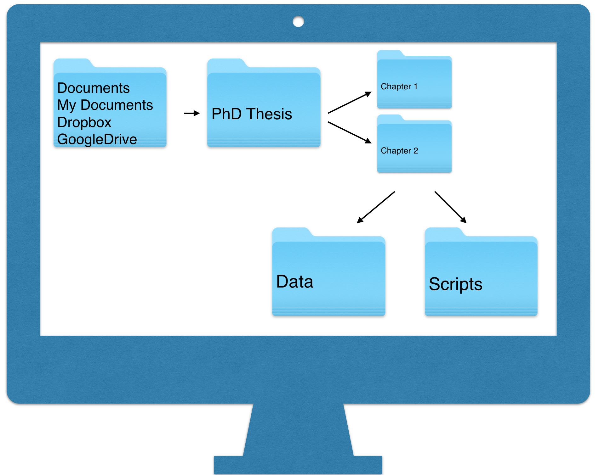
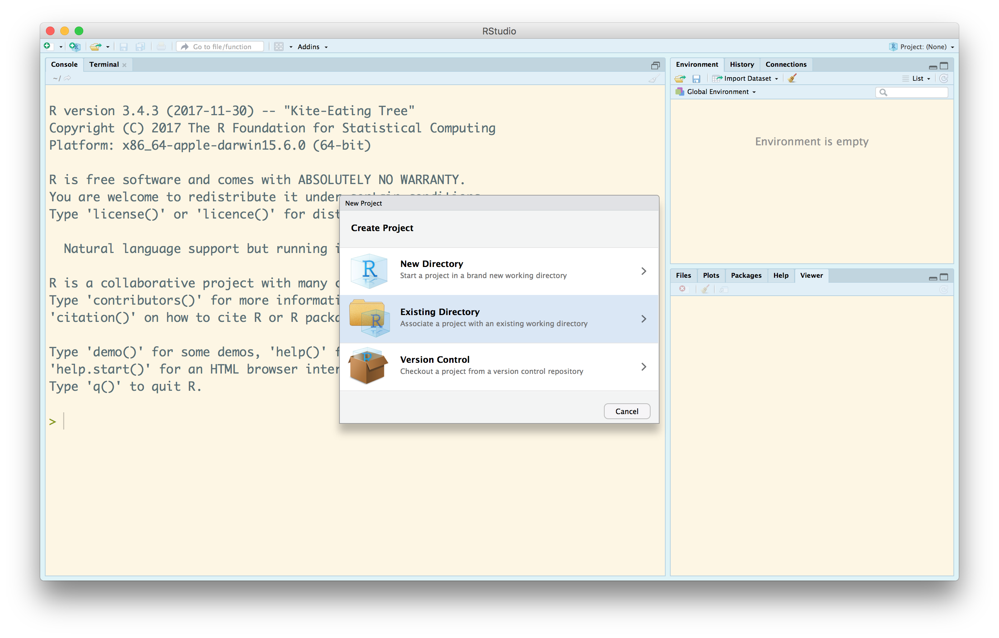
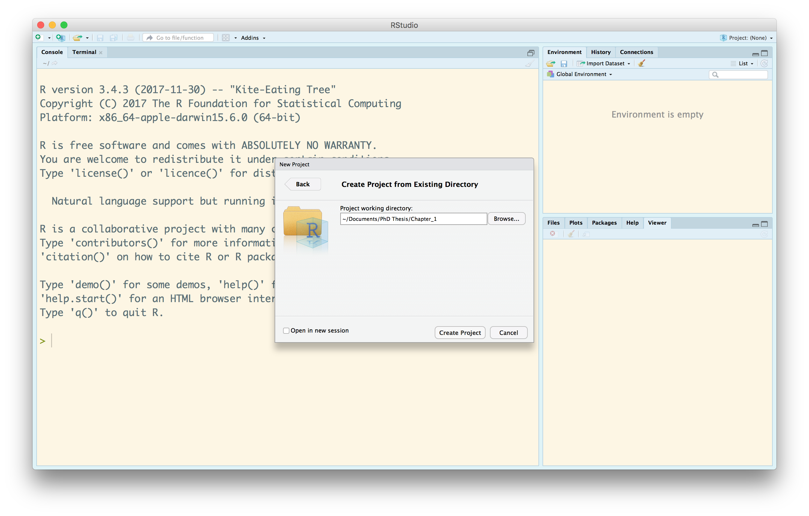
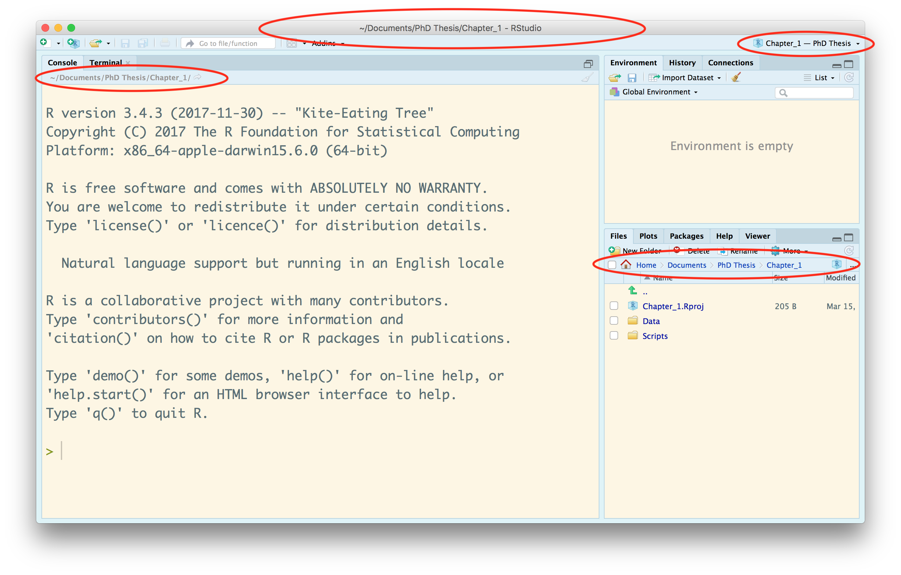

## What is this about?
In the past few years, RStudio has become the dominant interface to using R.  Built into RStudio is the capacity to create an .RProj file - an R Project.  

This new type of file has the potential to help you organise your work on projects in several ways.  It helps you keep files organised on your computer.  It helps you keep files organised for collaboration.  And it helps prevent some common mishaps, like forgetting where your data is on your computer.

While there are several ways to organise your project and analysis life, we've settled on this one with our course teaching.  It is a method that looks forward to researchers having an independent research career where they are acquiring, storing and analysing their own data, and one where they are sharing data analysis with others, or just themselves in the future.

Underlying this is a strong stear away from some commonly used habits, habits we've promoted in the past as well.  We'll revisit these at the end, but they largely centre around avoiding putting the following type of code in your script.

```{r eval = FALSE}
# Clear R's brain
rm(list = ls())

# set the working directory
setwd("~/Documents/SuperDooperProject/DataFiles/")

# read in the data
myData <- read.csv("Experiment_one.csv")
```

Our post has three sections

1. Setting up folders on your computer
2. Establishing a project with RStudio and what it does
3. Knowing when to start another project.

#### Setting up folders on your computer
The first step is to set up your computer with a set of folders that will store information in a logical way.  

We suggest the following basic setup. We assume most of you are probably using Dropbox or GoogleDrive, so that's a logical place to start.  If not, perhaps it is the Documents Folder (OS X) or the MyDocuments Folder (Window), depending on your platform.  Regardless, we suggest that you think about your core location for storing your files.

In this storage location, we advocate creating at least one folder that defines a project.  Some of you may be working on your PhD or Masters Thesis, others may be writing a Manuscript.  The folders you create here are the __high level__ folders that define the project remit.

For example, your PhD Thesis may have a core folder, and in this there can be a folder for each Chapter.  The Chapters are each an independent project.  Alternately, you many have a Manuscripts in Preparation Folder.  Inside that, you might have a folder for your Science 2018 paper you are writing, along with many others.  The papers you are writing are the independent projects.

They key is to make sure you organise things down to the level of the __independent project__, from which a chapter or manuscript will emerge.  

Inside any __independent project__ folder, we suggest that you create the following two folders: __Data__ and __Scripts__.  The Data folder will hold the one or more datasets central to the project.  The Scripts folder will hold the analysis scripts you develop using R.



## Establishing an RStudio Project File
So, you have organised your research life a little bit, and perhaps a bit differently than before.  The next step is to create an RStudio Project file in the __independent project__ folder.

It's now time to open RStudio.  What we are going to do is place a special file  called an RStudio Project inside our __independent project__ folder.  It won't be inside the Data or inside the Scripts folder.  Make sure you read that carefully.  In our picture above, the Project would live inside the Chapter 1 or Chapter 2 folder.








